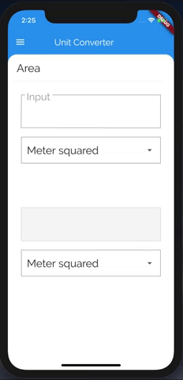

# MY_UNIT_CONVERTER

Clone unit converter application from udacity course with some enhancement.




## Feature

  - Get data from API
  - Unit conversion
  - Handle request error
  - BLoC design pattern apply

## Tech

* [BLOC & FLUTTER_BLOC](https://github.com/felangel/bloc/) -- A predictable state management library from Felix Angelov.
* [JSON SERIALIZABLE](https://github.com/dart-lang/json_serializable) -- Generates utilities to aid in serializing to/from JSON.
* [DIO](https://github.com/flutterchina/dio) -- A powerful Http client for Dart.

## API

  - Get category
```js
// GET REQUEST
https://private-f5e97-myunitconverter.apiary-mock.com/backdropList
```

  - Get detail cateogry
```js
// POST REQUEST
// BODY
{
  "AParam": "AValue",
  "BParam": [
    "BValue1",
    "BValue",
    "BValue3",
    "BValue4"
  ]
}
https://private-f5e97-myunitconverter.apiary-mock.com/fake/conversions
```